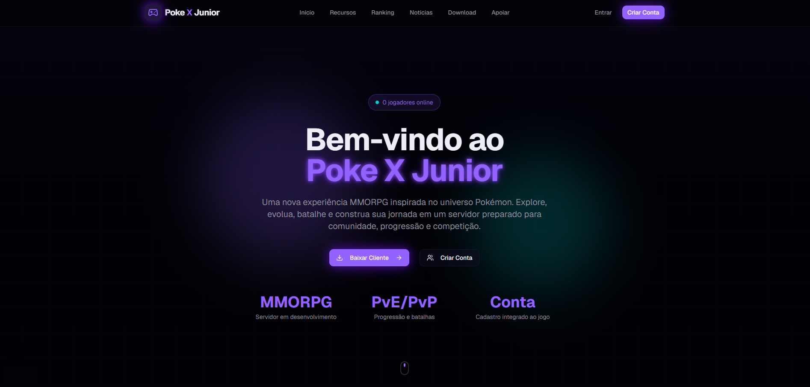
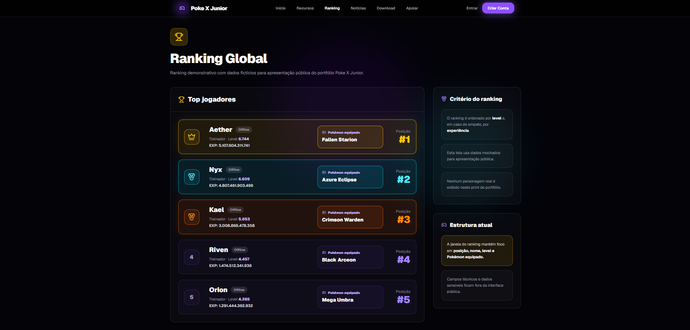
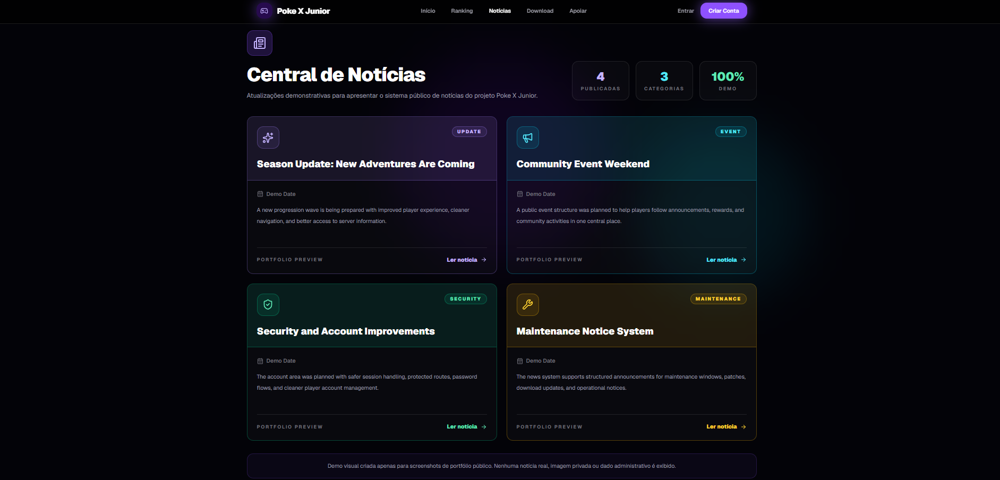
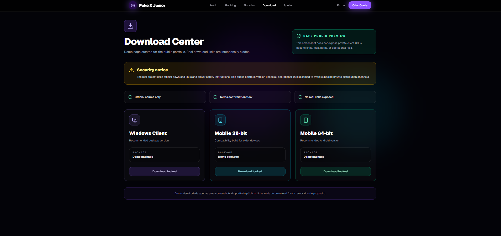
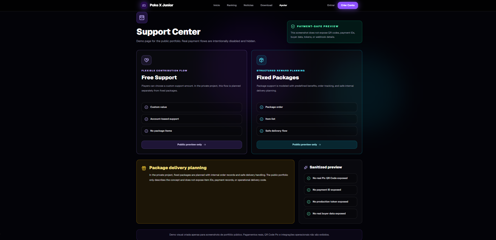
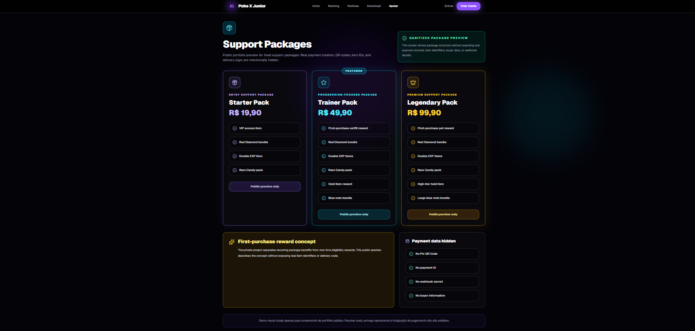
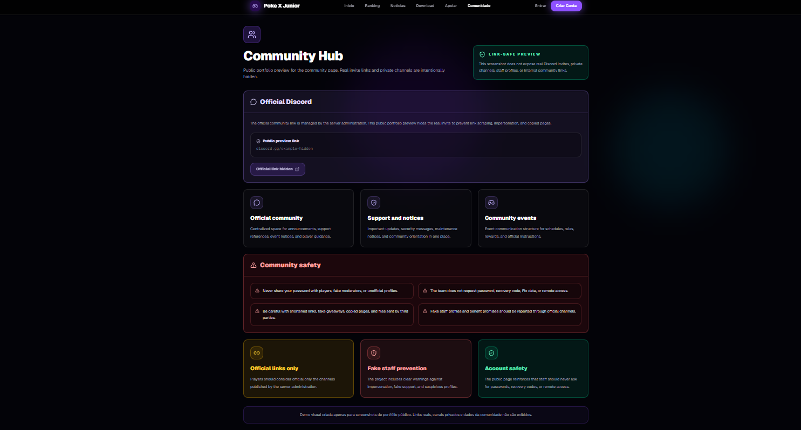

# Poke X Junior - Portfolio Case Study

Technical portfolio case study for a modern web platform developed for an MMORPG/OT-style game project.

This public repository does not contain the operational source code, production database, real integrations, credentials, payment logic, server internals, or private assets.

The goal is to present the project as a professional case study, showing product planning, architecture, features, security decisions, and visual documentation.

---

## Overview

Poke X Junior is a web platform designed to improve the presentation, account experience, content management, and support structure of a game server.

The private project includes public pages, player account features, ranking, news, admin tools, download pages, community links, legal pages, and a secure foundation for future Donate/Pix payment flows.

This public version is intentionally documentation-focused.

---

## Purpose of this repository

This repository exists to demonstrate:

* Technical planning
* Product organization
* Web architecture decisions
* Security awareness
* Frontend and backend design experience
* Administrative workflow planning
* Game website structure
* Payment flow design without exposing the real implementation

It is not a cloneable production system.

---

## Private project stack

The private implementation was built with:

* Next.js App Router
* TypeScript / TSX
* Tailwind CSS
* MySQL / MariaDB
* pnpm
* Server-side API routes
* HTTP-only session cookies
* Protected admin panel
* Secure upload handling
* Rate limiting on sensitive routes
* Planned Mercado Pago integration
* Private GitHub repository workflow

---

## Main feature areas

### Public website

* Landing page
* Player ranking
* News page
* Download page
* Community page
* Rules page
* Terms page
* Privacy policy page
* Donate overview
* Free support flow
* Package support flow

### Player account

* Login
* Logout
* Register
* Account dashboard
* Character list
* Character creation
* Password change
* Safe character deletion flow

### Admin area

* Protected news dashboard
* Create news
* Edit news
* Delete news
* Draft/publish workflow
* Secure image upload
* Admin-only access control

### Donate/Pix structure

The private project was designed to separate:

* Free support
* Fixed packages
* Payment orders
* Package items
* First-purchase rewards
* Internal game delivery flow
* Future payment webhook handling

Real payments are not active in this public portfolio.

---

## Security decisions

The private project includes several security-oriented decisions:

* Real environment files kept outside Git
* Operational repository kept private
* Basic security headers
* Rate limit on sensitive endpoints
* Upload validation by size, MIME type, extension, and magic bytes
* Path traversal protection
* HTTP-only session cookies
* Production secrets separated from local development
* Payment flow disabled until final VPS/domain deployment
* Private deploy checklist
* Public sanitization checklist before any public exposure

---

## Why the full code is not public

The complete private codebase contains operational logic, database access, authentication rules, admin behavior, payment planning, and game-specific internal details.

Publishing the full implementation would make direct copying easier and could expose unnecessary operational information.

This repository is therefore a portfolio case study, not a public template.

---

## Screenshot gallery

| Area            | Preview                                             |
| --------------- | --------------------------------------------------- |
| Home            |                   |
| Ranking         |             |
| News            |                   |
| Download        |           |
| Donate overview |  |
| Donate packages |  |
| Community       |         |

---

## Repository structure

```txt
poke-x-junior-portfolio/
├─ README.md
├─ docs/
│  ├─ architecture.md
│  ├─ features.md
│  ├─ security.md
│  └─ screenshots.md
└─ screenshots/
   ├─ home.png
   ├─ ranking.png
   ├─ news.png
   ├─ download.png
   ├─ donate-overview.png
   ├─ donate-packages.png
   └─ community.png
```

---

## Documentation

* [Features](docs/features.md)
* [Architecture](docs/architecture.md)
* [Security](docs/security.md)
* [Screenshots](docs/screenshots.md)

---

## Screenshots

Screenshots are stored in the `screenshots/` directory.

The public screenshots show visual results without exposing private data, real accounts, internal IDs, payment tokens, admin-only details, database information, or real community invite links.

---

## Status

* Private operational repository: active
* Public repository: portfolio/documentation only
* Real source code: private
* Real database: private
* Real payment credentials: private
* Public version: safe case study

---

## Author

Developed by **Shark_Protocol**.

This case study represents web development, product organization, UI planning, backend structure, and basic security hardening work applied to a real game-related project.
